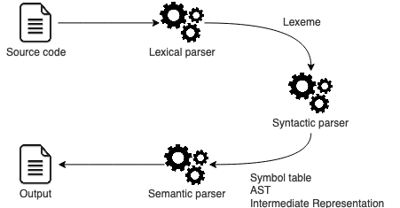

# Small interpreter with **Haskell**

The main objective of this mini project is to make our hands dirty with the **Haskell** programming language and to make use of some functional programming features to build an interpreter.

This is not my first time implementing a compiler/interpreter, I did build a compiler for a subset of the **ADA** programming language using **C** programming language, and you can find the source code [here](https://github.com/assalielmehdi/sample-spark-ada-compiler).

## Understanding how it works

Our interpreter is composed of mainly 3 programs, and I'm going to call them parsers: **Lexical** parser, **Syntactic** parser and **Semantic** parser.

Here is a schema illustrating our interpreter phases:



## Alphabet

## Grammar

```
Statment    ::= var := ArithExp Statment
              | if BoolExp then { Statment } else { Statment } Statment
              | while BoolExp do { Statment } Statment
              | epsilon

BoolExp     ::= true
              | false
              | BoolExp BoolOp BoolExp
              | ArithExp RelOp ArithExp
              | ( BoolExp )

ArithExp    ::= Term ArithExpAux

ArithExpAux ::= + Term ArithExpAux
              | - Term ArithExpAux
              | epsilon

Term        ::= Factor TermAux

TermAux     ::= * Factor TermAux
              | / Factor TermAux
              | epsilon

Factor      ::= var
              | int
              | ( ArithExp )

BoolOp      ::= and | or

RelOp       ::= > | <
```
